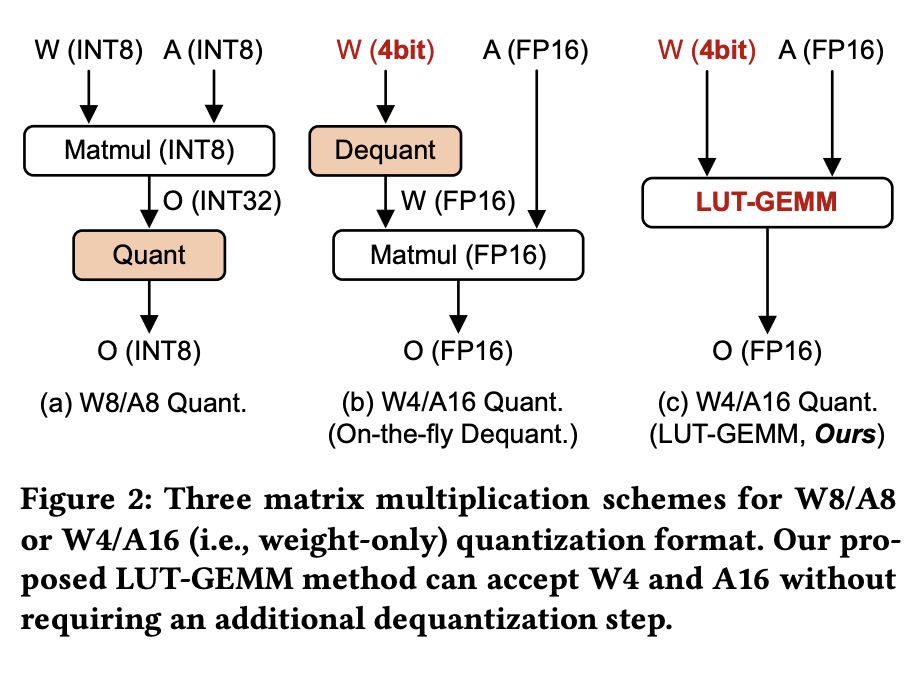

# LUT-GEMM

This repository provides the official implementation of LUT-GEMM from the following paper.

**LUT-GEMM: Qantized Matrix Multiplication based on LUTs for Efficient Inference in Large-Scale Generative Language Models**  

_Gunho Park, Baeseong Park, Minsub Kim, Sungjae Lee, Jeonghoon Kim, Beomseok Kwon, Se Jung Kwon, Byeongwook Kim, Youngjoo Lee, and Dongsoo Lee_

Paper: https://arxiv.org/pdf/2206.09557.pdf  

Abstract: Our proposed kernel, LUT-GEMM, accelerates quantized matrix multiplication by leveraging both uniform and non-uniform quantization techniques. Utilizing sub-4-bit quantized weights, it offers flexibility and achieves high compression ratios, allowing a balance between accuracy and efficiency. Through the use of low-bit quantization and efficient LUT-based operations, it effectively reduces memory usage and computational costs, thereby significantly enhancing the inference speed of large-scale language models.

<p align="center">  </p>


## Quick Start

Run the following commands to get **`Kernel Evaluation`** results in Table 1.

``` sh
mkdir build
cd build
cmake -DCMAKE_CUDA_ARCHITECTURES=80 ..
make -j8
./tests/tests  
```

## Citation

```
@misc{park2023lutgemm,
      title={LUT-GEMM: Quantized Matrix Multiplication based on LUTs for Efficient Inference in Large-Scale Generative Language Models}, 
      author={Gunho Park, Baeseong Park, Minsub Kim, Sungjae Lee, Jeonghoon Kim, Beomseok Kwon, Se Jung Kwon, Byeongwook Kim, Youngjoo Lee and Dongsoo Lee},
      year={2023},
      eprint={2206.09557},
      archivePrefix={arXiv},
      primaryClass={cs.DC}
}
```
